# Итоговый отчёт - Solar Power Plant (Time Series Analysis)

Прогноз суммарной AC-мощности солнечных блоков (Plant 1 и Plant 2) на **48 часов** (2 суток).

**Ноутбуки:** `0_preprocessing_eda.ipynb` → `1_stats_models.ipynb` → `2_dl_models.ipynb` → `3_pipeline.ipynb`  
**Код пайплайна:** `src/pipeline.py`  
**Тестовая выборка:** `__output__/test.parquet` (hold-out, последние 48 ч × 2 блока)  
**Графики экспериментов:** `img/`

---

## Описание временного ряда

| Параметр | Значение |
| --- | --- |
| Источник | [Kaggle - Solar Power Plant](https://www.kaggle.com/datasets/anikannal/solar-power-generation-data/data) |
| Период | 15.05.2020 - 17.06.2020 (~34 суток) |
| Исходная частота | 15 мин → агрегация **1 ч** |
| Целевой ряд | `AC_POWER` (kW), сумма по инверторам блока |
| Экзогенные признаки | `IRRADIATION`, `AMBIENT_TEMPERATURE`, `MODULE_TEMPERATURE` |
| Серии | `unique_id` = `1` (Plant 1), `2` (Plant 2) |

## Постановка задачи

| Параметр | Значение |
| --- | --- |
| Горизонт | 48 часов |
| Режим | Offline batch |
| Train / Test | все данные кроме последних 48 ч / последние 48 ч |
| Метрики | MAE, RMSE, MAPE, sMAPE (+ вариант без нулевого таргета) |
| Сезонность | Суточная (period = 24) |

**Особенности:** ~46% часов с нулевой выработкой (ночь). MAPE/sMAPE на полном ряду завышены - дополнительно отчитываем метрики **`no_zeros`** (только дневные часы с выработкой > 0).

---

## Задача 1. Подготовка данных и EDA

**Материалы:** `0_preprocessing_eda.ipynb`, `src/data.py`  
**Код генерирует:** `__output__/train.parquet`, `test.parquet`, `hourly.parquet`

**Выполнено:**
- Загрузка и объединение Generation + Weather для Plant 1 и Plant 2
- Агрегация инверторов, resample 1 ч, интерполяция пропусков
- Базовый анализ: типы, пропуски, диапазоны, описательная статистика
- EDA: временной ряд, сезонная декомпозиция, ACF/PACF, ADF-тест, связь с инсоляцией
- Постановка задачи и сохранение подготовленных данных

### Визуализация (задача 1)

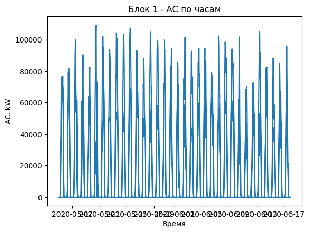

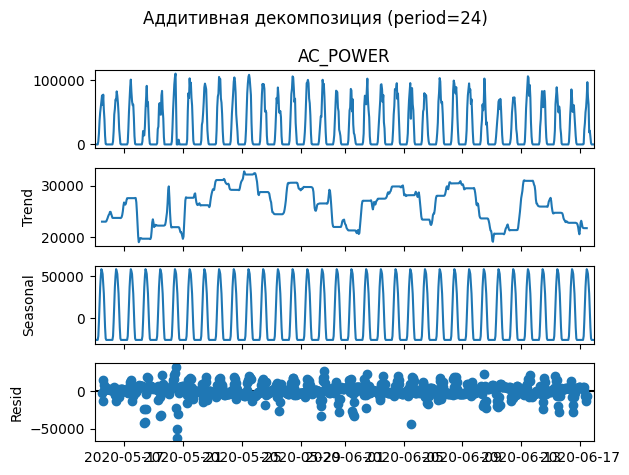

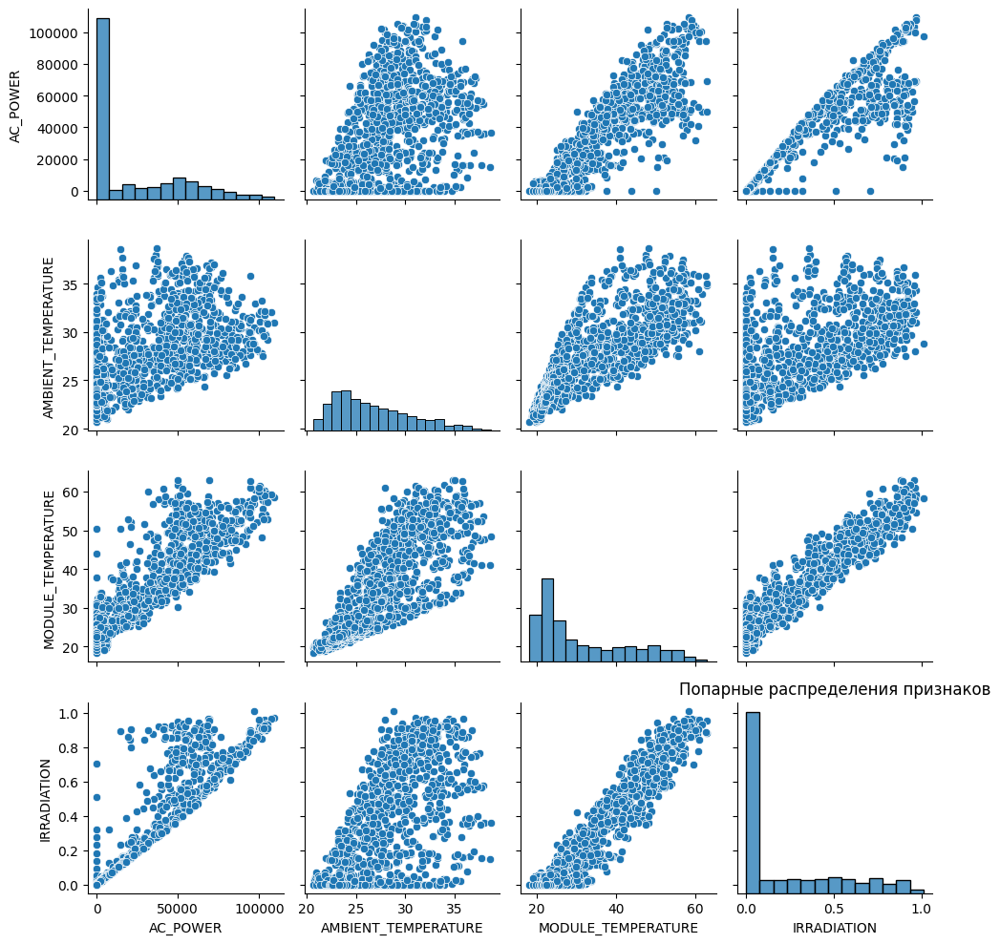

### Вывод по задаче 1

1. Ряд **нестационарен**; выражена **суточная сезонность** (period=24); после lag=24 ряд ближе к стационарности.
2. **~46%** наблюдений - нулевая выработка ночью; это критично для выбора метрик и трансформаций.
3. Связь `AC_POWER` ↔ `IRRADIATION` **сильная** - погодные признаки обоснованы для ML/DL.
4. Данные приведены к машино-читаемому виду (pandas, parquet), hold-out - **48 последних часов** для каждого блока (96 строк test).
5. Горизонт **48 ч** и offline-режим соответствуют задаче краткосрочного планирования выработки на 2 суток.

---

## Задача 2. Статистические модели (`statsforecast`)

**Материалы:** `1_stats_models.ipynb`, `src/stats.py`

**Сравнено ≥5 методов** (auto + manual + baseline):

| Модель | Режим | RMSE (all) | sMAPE (all) | RMSE (no zeros) | sMAPE (no zeros) | Backtest RMSE | Backtest sMAPE |
| --- | --- | --- | --- | --- | --- | --- | --- |
| Naive | baseline | 32577 | 108.3 | 44264 | 200.0 | ~39952 | 108.3 |
| SeasonalNaive | baseline | 10990 | **19.0** | 14932 | 35.0 | ~12266 | **15.4** |
| AutoETS | auto | **8682** | 109.4 | 11704 | 32.8 | ~9933 | 107.7 |
| AutoTheta | auto | 9048 | 106.7 | 12294 | 27.7 | **~9685** | 104.4 |
| AutoARIMA | auto | 9852 | 43.9 | 13386 | 32.3 | ~11445 | 35.7 |
| Theta | manual (mult.) | 9040 | 106.7 | 12283 | 27.7 | - | - |
| ARIMA | manual | 25231 | 158.8 | 32480 | 123.9 | - | - |

**Обоснование надёжности:**
- Rolling **backtest** (`cross_validation`, h=24, 5 окон, step=24)
- **Анализ остатков:** ACF, Q–Q, Ljung–Box (in-sample)
- **Hold-out** 48 ч, метрики all / no_zeros
- **Визуализация** прогнозов на test - см. ниже

### Визуализация (задача 2)

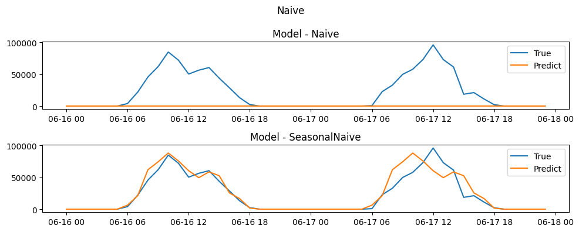

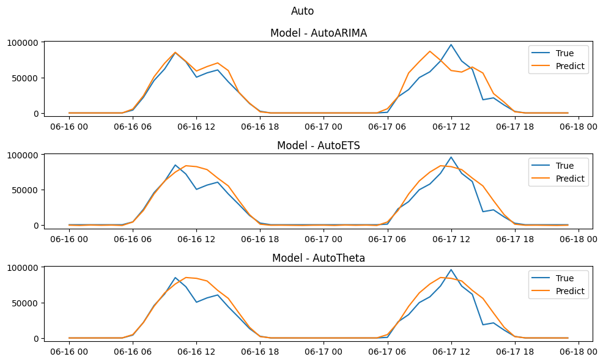

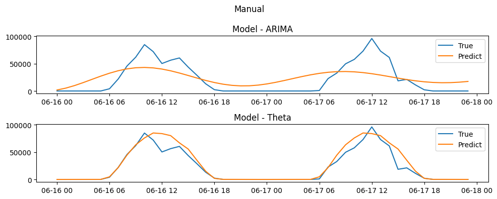

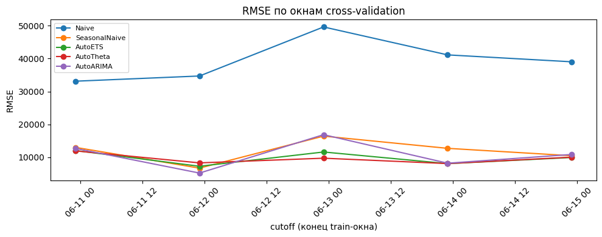

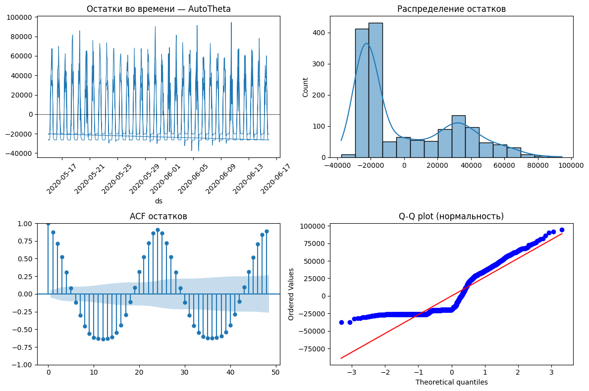

### Вывод по задаче 2

1. Все stats-модели **существенно лучше Naive**; SeasonalNaive - сильный baseline (sMAPE ≈ **19%** all, **15.4%** backtest).
2. По **hold-out RMSE** лучший auto-метод - **AutoETS (8682)**; manual **Theta (mult.)** сопоставим (9040).
3. По **rolling backtest** стабильнее всего **AutoTheta (RMSE ≈ 9685, sMAPE ≈ 104)**.
4. **AutoARIMA** точнее manual ARIMA, но медленнее (~185 с fit vs ~2 с у ETS/Theta).
5. **Остатки** аддитивных моделей асимметричны из-за ночных нулей; multiplicative Theta предпочтительнее для интерпретации.
6. **Итоговый выбор среди stats:** AutoETS по hold-out RMSE, AutoTheta по backtest, SeasonalNaive как interpretable baseline.

---

## Задача 3. ML, DL и аномалии

**Материалы:** `2_dl_models.ipynb`, `src/anomaly.py`

### 3.1. Аномалии (3 метода)

| Метод | Параметры | Plant 1 (train) |
| --- | --- | --- |
| IQR | k = 1.5 | 0 |
| STL + Z-score | period=24, \|z\| > 3 | 24 |
| Isolation Forest | contamination=0.02 | 16 |

**Выбор:** STL + Z-score - основной интерпретируемый метод; Isolation Forest - многомерные отклонения (power + weather).

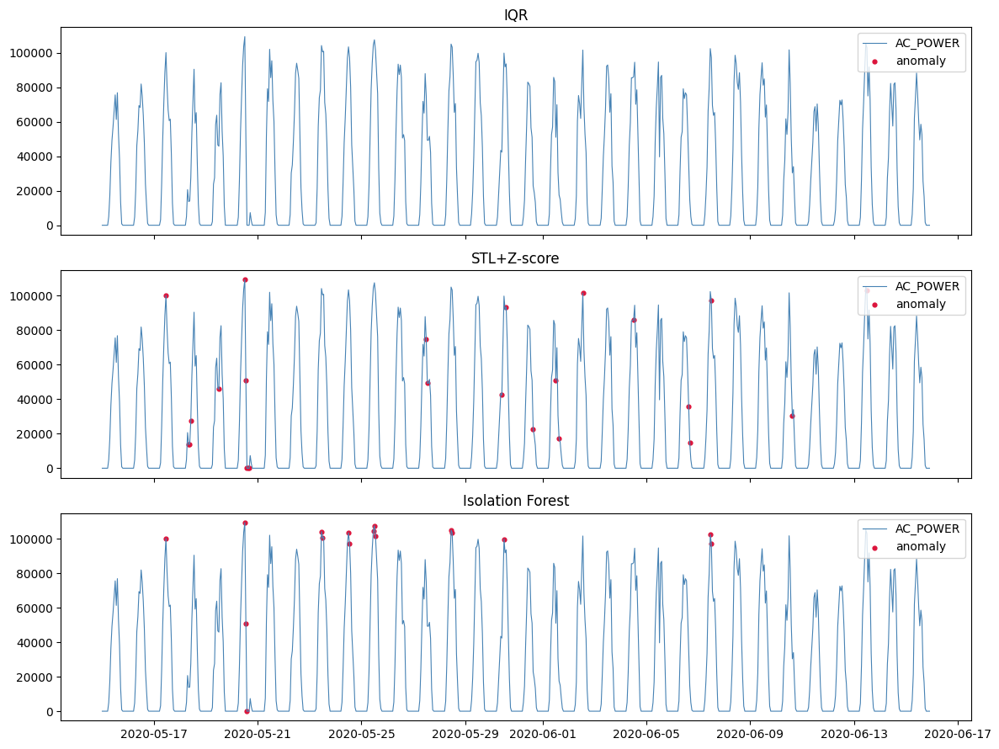

### 3.2. ML (`mlforecast`) - 3 модели

| Модель | RMSE (all) | sMAPE (all) | RMSE (no zeros) | sMAPE (no zeros) | Backtest RMSE | Backtest sMAPE |
| --- | --- | --- | --- | --- | --- | --- |
| RandomForestRegressor | **4273** | **5.6** | 5805 | **10.4** | ~10772 | 29.3 |
| Ridge | 7612 | 107.2 | 10001 | 28.7 | ~10978 | 111.7 |
| LGBMRegressor | 5327 | 99.9 | 7230 | 15.1 | ~10293 | 119.8 |

**Features:** lags 1,2,6,12,24 + expanding/rolling transforms + `IRRADIATION`, температуры + hour/dow.  
**`Differences([24])` отключён** - на zero-heavy ряду ухудшает качество.

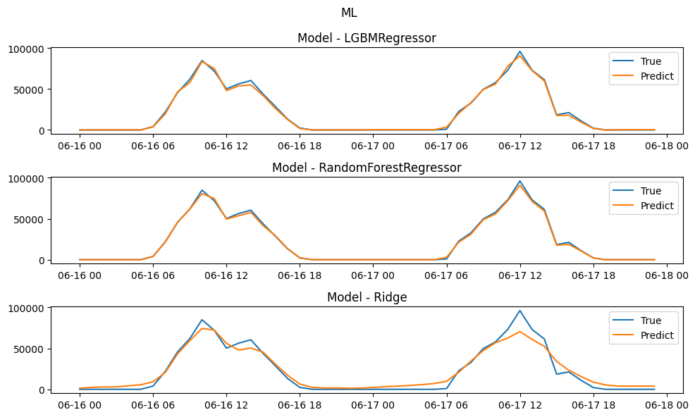

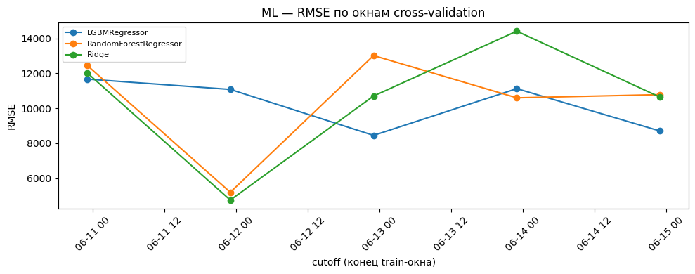

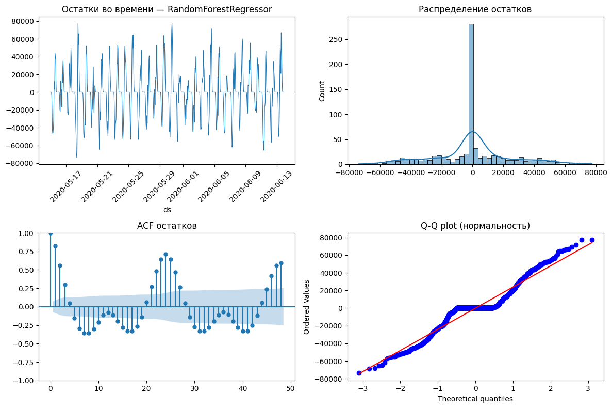

### 3.3. DL (`neuralforecast`) - 3 модели

| Модель | RMSE (all) | sMAPE (all) | RMSE (no zeros) | sMAPE (no zeros) | Backtest RMSE | Backtest sMAPE |
| --- | --- | --- | --- | --- | --- | --- |
| NHITS | 8997 | 108.9 | 12223 | 31.9 | ~12942 | 107.5 |
| NBEATS | 10227 | 109.3 | 13888 | 32.5 | **~14159** | 112.2 |
| LSTM | 9981 | 112.5 | 13548 | 38.5 | ~15297 | 110.1 |

Параметры: `input_size=72`, `max_steps=200`, `h=48`.

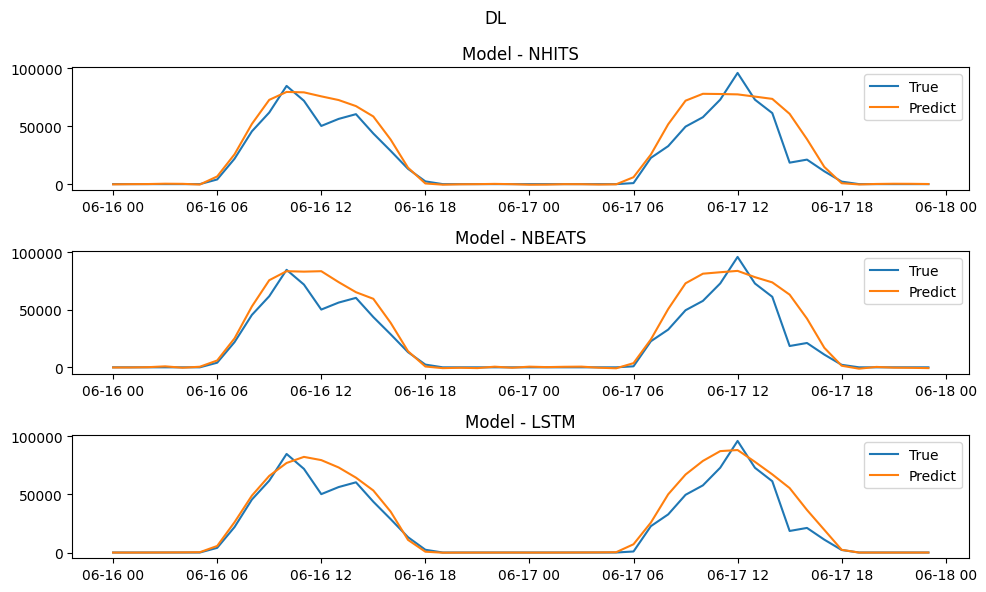

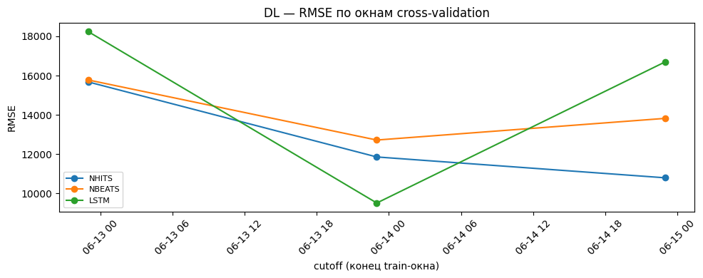

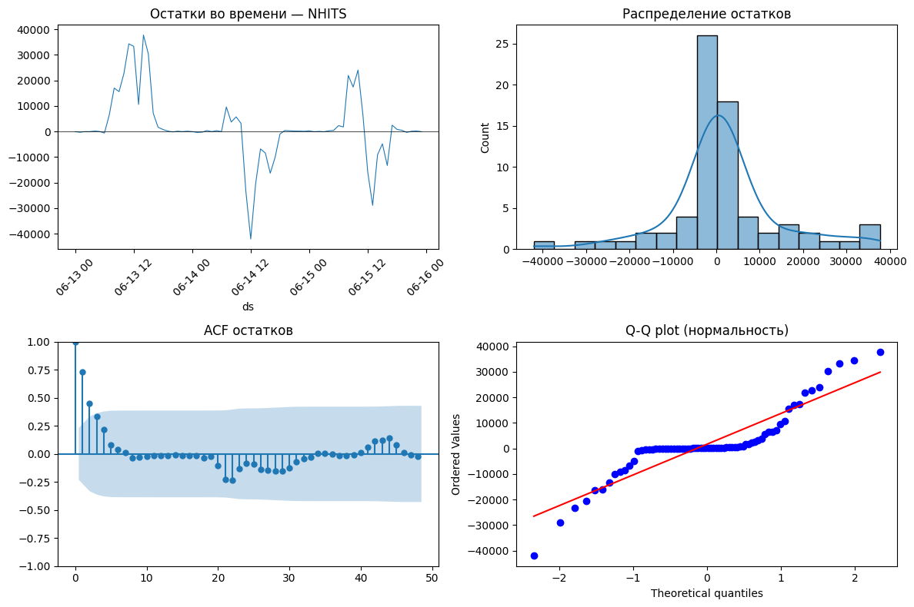

### Вывод по задаче 3

1. **RandomForest** - лучший ML по hold-out: RMSE **4273**, sMAPE **5.6%** (all); с `no_zeros` - sMAPE **10.4%**.
2. **Ridge** - лучший RMSE среди ML на полной выборке без тяжёлого обучения (7612), но sMAPE all ≈ 107%.
3. **DL (NHITS)** - RMSE ≈ **8997** на hold-out; sMAPE all ≈ 109%, no_zeros ≈ **31.9%**; backtest хуже ML/stats.
4. **`Differences([24])` исключён** - экспериментально ухудшал LGBM.
5. Для **аномалий** STL+Z-score выделил 24 точки; IQR на часовых данных не сработал (0 точек).
6. **Итог:** RandomForest - лучший баланс точности и скорости с погодными exog; DL - запасной вариант при большем объёме данных.

---

## Задача 4. Пайплайн и тестирование

**Материалы:** `3_pipeline.ipynb`, `src/pipeline.py`

**Класс `SolarForecastPipeline`:**
1. `build_datasets()` - загрузка, split, parquet
2. `fit()` / `predict()` - stats / ML (с погодой через `to_ml_frame`) / DL
3. Метрики `metrics` + `metrics_no_zeros` → `__output__/pipeline/metrics.json`

**Модель по умолчанию:** `RandomForestRegressor` (`src/config.py`)

**Поддерживаемые модели:** Naive, SeasonalNaive, AutoTheta, AutoETS, AutoARIMA, LGBMRegressor, RandomForestRegressor, Ridge, NHITS, NBEATS, LSTM

### Benchmark (hold-out, `3_pipeline.ipynb`)

| Модель | RMSE (all) | sMAPE (all) | RMSE (no zeros) | sMAPE (no zeros) | fit (s) |
| --- | --- | --- | --- | --- | --- |
| RandomForestRegressor | **4356** | **5.7** | 5919 | **10.5** | **0.3** |
| AutoETS | 8682 | 109.4 | 11704 | 32.8 | 2.1 |
| AutoTheta | 9048 | 106.7 | 12294 | 27.7 | 2.1 |
| NHITS | 9129 | 108.5 | 12402 | 31.1 | 5.9 |
| AutoARIMA | 9978 | 108.2 | 13557 | 30.5 | 185.0 |
| SeasonalNaive | 10990 | 19.0 | 14932 | 35.0 | 2.0 |
| Naive | 32577 | 108.3 | 44264 | 200.0 | 2.0 |

### Вывод по задаче 4

1. Пайплайн **воспроизводим**: `build_datasets()` + `SolarForecastPipeline().run()` сохраняет forecast, evaluation и metrics.
2. **RandomForestRegressor** - default: RMSE **4356**, sMAPE **5.7%** (all), sMAPE **10.5%** (no zeros); fit **< 0.5 с**.
3. **SeasonalNaive** - лучший sMAPE среди stats на полном ряду (**19%**), полезен как лёгкий baseline.
4. **AutoETS / AutoTheta** - быстрые stats-альтернативы (~2 с) с RMSE 8682–9048.
5. **NHITS** - RMSE 9129, но sMAPE ~108% (all) и fit ~6 с; ROI низкий на коротком ряде.
6. Метрики в **двух вариантах** (all / no_zeros) встроены в пайплайн.

---

## Сводная таблица выбора методов

| Семейство | Модель | RMSE (all) | sMAPE (all) | sMAPE (no zeros) | Комментарий |
| --- | --- | --- | --- | --- | --- |
| Baseline | SeasonalNaive | 10990 | **19.0** | 35.0 | Лучший sMAPE (all) среди stats |
| Statistical | AutoETS | 8682 | 109.4 | 32.8 | Лучший RMSE среди stats (hold-out) |
| Statistical | AutoTheta | 9048 | 106.7 | 27.7 | Лучший RMSE на backtest |
| ML | RandomForestRegressor | **4356** | **5.7** | **10.5** | Default пайплайна |
| ML | Ridge | 7612 | 107.2 | 28.7 | Линейный ML-baseline |
| DL | NHITS | 8997 | 108.9 | 31.9 | Лучший DL на hold-out |
| Anomaly | STL + Z-score | - | - | - | 24 точки, interpretable |

---

## Общее заключение

**Набор данных:** почасовая выработка двух блоков солнечной станции (Индия, ~34 суток).  
**Цель:** offline-прогноз AC-мощности на **48 часов** для краткосрочного планирования.

**Численные результаты:**
- Baseline SeasonalNaive: RMSE **10990**, sMAPE **19.0%** (all) / **35.0%** (no zeros)
- Лучший statistical hold-out: AutoETS, RMSE **8682**, sMAPE **109.4%** / **32.8%**
- Лучший statistical backtest: AutoTheta, RMSE **~9685**, sMAPE **~104%**
- Лучший ML/DL в пайплайне: RandomForestRegressor, RMSE **4356**, sMAPE **5.7%** / **10.5%**
- DL NHITS: RMSE **8997**, sMAPE **108.9%** (all), backtest RMSE ~12942

**Итоговое решение:** пайплайн `SolarForecastPipeline` с **RandomForestRegressor** и погодными exog. Выбор обоснован сравнением ≥5 stats-, 3 ML- и 3 DL-моделей, rolling backtest, анализом остатков, визуализацией на test и benchmark по fit/predict.

**Ограничения:** короткий ряд (~34 дня) и горизонт 48 ч ограничивают обобщение DL; ~46% нулей ночью требуют отчёта sMAPE в двух вариантах; stats-модели не используют погоду напрямую.

**Соответствие [итоговому заданию](https://github.com/MVRonkin/TimeSeriesCourse/blob/main/Last/README.md):** задачи 1–4 выполнены с выводами, численными результатами, графиками (`img/`) и общим заключением.

---

## Запуск

```bash
uv sync
uv run python -c "from src.data import build_datasets; build_datasets()"
uv run jupyter notebook
```

## Структура репозитория

| Файл | Задача |
| --- | --- |
| `0_preprocessing_eda.ipynb` | Задача 1 - EDA |
| `1_stats_models.ipynb` | Задача 2 - statsforecast |
| `2_dl_models.ipynb` | Задача 3 - ML/DL, аномалии |
| `3_pipeline.ipynb` | Задача 4 - пайплайн |
| `src/` | Переиспользуемый код |
| `img/` | Графики экспериментов |
| `__output__/` | Parquet и артефакты |
